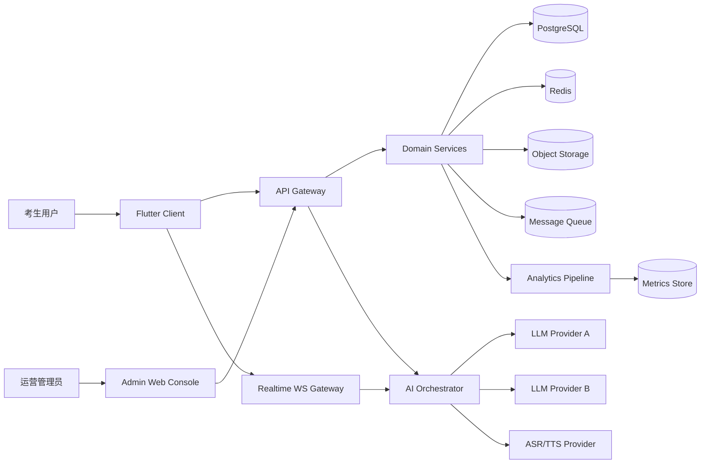
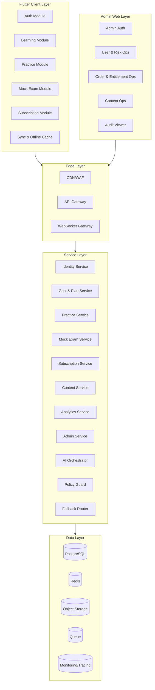

# Technical Architecture（统一架构说明书）

## 文档信息
- 文档版本: v1.0
- 状态: Baseline
- 创建日期: 2026-02-25
- 适用范围: 标准商业版首发（12 周）
- 关联文档:
1. `docs/PRD-IELTS-AI-App.md`
2. `docs/PRD-Appendix-IA-Data-API.md`
3. `docs/PRD-Appendix-QA-Acceptance.md`
4. `docs/backlog/Epic-Map.md`
5. `docs/engineering/Database-Schema-Draft.md`
6. `docs/engineering/AI-Agent-Task-Breakdown.md`

## 1. 架构目标
1. 支撑中国大陆雅思考生的听、说、读、写提分闭环。
2. 一套客户端技术覆盖 iOS/Android/Windows/macOS。
3. 支撑 AI 虚拟对练教练、即时反馈、计划动态更新。
4. 支撑多 LLM Provider 可插拔和故障回退。
5. 满足 PRD 非功能指标与上线门禁。

## 2. 范围与边界
### 2.1 In Scope
1. 客户端架构（Flutter 四端）。
2. 服务端分层（API Gateway + Domain Services + AI Orchestrator）。
3. 数据架构（PostgreSQL + 缓存 + 对象存储 + 事件管道）。
4. 实时口语链路（WebSocket + ASR/LLM + 反馈回传）。
5. 安全、可观测、发布与容灾策略。
6. Admin Web 后台管理系统（RBAC、审计、运营操作）。

### 2.2 Out of Scope
1. 面向外部机构的 B2B 机构平台架构。
2. 真人外教交易系统。
3. 线下课程排课系统。

## 3. 架构原则
1. 领域隔离: 账号、学习、训练、模考、订阅、AI 分域清晰。
2. 接口稳定: 对外 API 版本化，对内通过契约保持兼容。
3. AI 可替换: 通过 Adapter 层屏蔽 Provider 差异。
4. 默认可观测: 关键链路必须带 `trace_id`、指标、告警。
5. 失败优先设计: 超时、降级、回退是默认路径而非补丁。
6. 合规内建: 隐私、版权、审计在设计阶段前置。

## 4. 系统上下文（C4-Context）

## 5. 逻辑架构（C4-Container）

## 6. 组件与职责
| 组件 | 核心职责 | 输入 | 输出 | 依赖 |
|---|---|---|---|---|
| Flutter Client | 多端 UI、会话管理、离线缓存、埋点上报 | 用户操作、网络响应 | API/WS 请求、事件上报 | API Gateway、WS Gateway |
| API Gateway | 统一鉴权、限流、路由、审计入口 | REST 请求 | 领域服务响应 | Identity、Domain Services |
| WS Gateway | 口语实时会话连接与心跳管理 | 实时语音/文本流 | 实时反馈流 | AI Orchestrator |
| Identity Service | 用户身份、令牌、会话、设备 | 登录/刷新请求 | Token、会话状态 | PostgreSQL、Redis |
| Goal & Plan Service | 目标设定、诊断结果、学习计划 | 目标数据、训练结果 | 周计划、任务包 | PostgreSQL、AI Orchestrator |
| Practice Service | 听说读写训练会话、重练、反馈存储 | 题目作答 | 评分反馈、复练建议 | AI Orchestrator、Object Storage |
| Mock Exam Service | 模考编排、提交、报告生成 | 模考答案 | 模考报告、计划更新触发 | Queue、Practice/Plan Service |
| Subscription Service | 试用/订阅权益、订单、回调处理 | 支付请求/回调 | 权益状态 | Billing Provider、PostgreSQL |
| Admin Service | RBAC 鉴权、后台操作编排、审计落盘 | Admin 请求 | 操作结果、审计记录 | Identity、Subscription、Content、Analytics |
| AI Orchestrator | Agent 编排、Provider 调用、结果聚合 | 任务上下文 | 结构化 AI 输出 | Adapter、Fallback、Guardrail |
| Analytics Service | 行为事件接收、聚合、指标输出 | 事件批量 | 报表数据、告警输入 | Queue、Metrics Store |

## 7. 关键运行时流程
### 7.1 Onboarding 与诊断
1. 客户端调用 `POST /v1/users/onboarding`。
2. Goal & Plan Service 存储目标并投递诊断任务。
3. AI/规则引擎生成能力估计与 8 周计划。
4. 返回 `assessment_id` 与 `plan_id`。

### 7.2 口语实时对练
1. 客户端通过 `WS /v1/realtime/speaking` 建立连接。
2. 音频流经 ASR 转文本，进入 Coach + Evaluator。
3. Guardrail 过滤输出，Fallback 处理主模型失败。
4. 分项评分与建议实时回传并落库 `practice_sessions`。

### 7.3 写作批改
1. 客户端调用 `POST /v1/practice/sessions`（skill=`writing`）。
2. Evaluator 输出 TR/CC/LR/GRA 四维评分与证据句。
3. Coach 生成改写建议并返回结构化反馈。
4. 反馈写入 `practice_feedback_items`。

### 7.4 模考与回写
1. 创建模考 `POST /v1/mock-exams`。
2. 提交答案 `POST /v1/mock-exams/{exam_id}/submit`。
3. 异步生成报告 `GET /v1/mock-exams/{exam_id}/report`。
4. Planner Agent 根据报告更新下一周计划。

### 7.5 订阅与权益
1. 客户端发起升级 `POST /v1/subscription/upgrade`。
2. 支付平台 webhook 回调 `POST /v1/payments/webhooks/provider`。
3. Subscription Service 幂等处理订单并更新权益。
4. 客户端通过 `GET /v1/subscription/entitlement` 拉取最新状态。

### 7.6 后台管理操作
1. Admin 端登录 `POST /v1/admin/auth/login` 并加载角色菜单。
2. 管理员执行用户冻结/解冻或权益校正。
3. Admin Service 做 RBAC 校验并调用对应领域服务。
4. 操作结果落库并写入审计日志。

## 8. API 与契约策略
1. 对外 API 前缀统一 `/v1`。
2. 后台管理接口前缀统一 `/v1/admin/*`。
3. 非破坏性变更允许字段新增，破坏性变更升级 `/v2`。
4. 所有写接口支持 `Idempotency-Key`。
5. 统一错误码语义: `400/401/403/404/409/429/500/503`。
6. 内部接口使用契约测试保证字段稳定。

## 9. 数据架构
### 9.1 存储选型
1. 事务主库: PostgreSQL（用户、计划、训练、模考、订阅）。
2. 缓存与短态: Redis（会话态、热点查询、限流计数）。
3. 对象存储: 音频/转写附件/大文本中间件。
4. 队列: 模考报告、异步批改、事件处理。

### 9.2 领域分库逻辑（逻辑分域，不强制物理分库）
1. Identity Domain
2. Learning Domain
3. Practice Domain
4. Exam Domain
5. Subscription Domain
6. AI Ops Domain
7. Analytics Domain
8. Admin Ops Domain

### 9.3 数据一致性策略
1. 强一致: 账号、订阅权益、订单状态。
2. 最终一致: 计划更新、分析事件、报表聚合。
3. 幂等保障: 订单回调、模考提交、重试写入。

### 9.4 生命周期与归档
1. `analytics_events` 明细保留 12 个月。
2. 训练会话热数据保留 180 天后归档。
3. 支付与审计日志长期保留。

## 10. AI 架构
### 10.1 Agent 角色
1. Coach Agent: 对练追问与改进建议。
2. Evaluator Agent: 结构化评分与证据提取。
3. Planner Agent: 学习计划更新。
4. Guardrail Agent: 输入输出安全策略。

### 10.2 Provider 抽象
内部统一接口:
1. `generateText`
2. `generateSpeechFeedback`
3. `scoreWriting`
4. `healthCheck`

### 10.3 路由与回退
1. 输入维度: `task_type`, `provider_health`, `cost_policy`。
2. 触发条件: 超时、错误率、预算上限。
3. 目标指标: 回退后总体成功率 >= 99%。

### 10.4 质量与评测
1. 离线评测集覆盖口语与写作核心场景。
2. 发布前强制评测门禁。
3. 在线指标监控:
- 成功率
- 延迟
- 回退率
- 输出字段缺失率
- 用户反馈满意度

## 11. 安全与合规架构
### 11.1 身份与鉴权
1. OAuth2/JWT 风格令牌体系。
2. 刷新令牌轮换与黑名单失效。
3. 关键接口启用限流与异常行为检测。
4. Admin 接口强制 RBAC 与操作审计。

### 11.2 数据保护
1. 传输层 TLS 全覆盖。
2. 敏感字段加密存储。
3. 日志脱敏，禁止明文输出敏感信息。

### 11.3 合规控制
1. 支持账号注销与数据删除流程。
2. 建立题库版权来源与审计记录。
3. AI 输出内容经过 Guardrail 过滤。

## 12. 可观测与 SRE
### 12.1 三大支柱
1. Metrics: QPS、错误率、P95、回退率、崩溃率。
2. Logs: 结构化日志 + `trace_id`。
3. Traces: 跨 Gateway/Service/AI Provider 链路追踪。

### 12.2 SLO 与告警门槛
| 指标 | 目标 |
|---|---|
| API P95 延迟 | <= 1.5 秒 |
| AI 首 token P95 | <= 3 秒 |
| 模考报告生成 P95 | <= 120 秒 |
| 核心服务可用性 | >= 99.9% |
| 客户端崩溃率 | <= 0.3% |

### 12.3 告警分级
1. Sev-1: 核心链路不可用，15 分钟内启动应急。
2. Sev-2: 关键性能退化，30 分钟内缓解。
3. Sev-3: 局部异常，下一版本修复。

## 13. 部署拓扑
### 13.1 环境分层
1. Dev: 开发联调与单元测试。
2. Staging: 预发布与集成回归。
3. Prod: 正式环境，分阶段灰度。

### 13.2 部署策略
1. 服务端容器化部署，支持水平扩缩。
2. API Gateway 与 WS Gateway 独立扩展。
3. 状态存储（PostgreSQL/Redis）采用高可用部署。
4. 对象存储与队列服务使用托管能力。

### 13.3 客户端发布
1. iOS/Android 通过应用商店发布。
2. Windows/macOS 采用安装包与自动更新策略。
3. 使用远程配置和特性开关控制高风险功能。
4. Admin Web 通过灰度域名发布，限制内网或白名单访问。

## 14. 容灾与连续性
1. 数据库每日全量备份 + 高频增量备份。
2. 恢复目标:
- RPO <= 15 分钟
- RTO <= 60 分钟
3. 服务层多可用区部署，单区故障可降级运行。
4. AI Provider 失效时启用备 Provider 和降级文案。

## 15. 成本治理
1. AI 调用成本分层:
- 高价值路径（口语批改/写作评分）优先高质量模型。
- 低价值路径（摘要/提醒）优先低成本模型。
2. 缓存重复请求结果，降低重复调用。
3. 设定 provider 预算阈值并触发策略切换。
4. 周度输出成本报表（按 task_type/provider 分解）。

## 16. CI/CD 与质量门禁
1. PR 级门禁:
- 单元测试
- 契约测试
- 安全扫描
2. 发布级门禁:
- P0 缺陷为 0
- AI 评测通过
- 性能指标达标
3. 生产发布采用灰度 + 回滚预案。

## 17. 架构决策与变更治理
1. 重大架构变更需更新本文件并记录至 `docs/tracking/decisions.md`。
2. 新增外部依赖必须经过安全与合规评审。
3. API 破坏性改动必须发布迁移方案。
4. 数据模型变更需附迁移脚本与回滚方案。

## 18. 与 Epic/Story 映射
| 架构域 | 对应 Epic |
|---|---|
| 身份与同步 | E01 |
| 诊断与计划 | E02 |
| 训练引擎（听/读/说/写） | E03/E04/E05/E06 |
| 模考与报告 | E07 |
| 订阅与权益 | E08 |
| 可观测与运维 | E09 |
| 质量与发布 | E10 |
| 后台管理 | E11 |

## 19. 待确认项
1. 生产区域部署策略（单区域起步或双区域起步）。
2. 支付 Provider 最终集合。
3. ASR/TTS 供应商最终选择与 SLA。
4. 数据删除合规 SLA（具体小时数）。
5. 题库版权供应链的审计流程细节。

## 20. 默认决策（当前生效）
1. 客户端统一 Flutter 四端。
2. 服务端采用 Gateway + Domain + AI Orchestrator 分层。
3. 数据主存储采用 PostgreSQL，缓存采用 Redis。
4. AI 能力采用多 Provider 可插拔与自动回退。
5. 发布模式采用分环境 + 灰度 + 门禁。
6. 首发包含 Admin Web 后台最小闭环。
